# PES-VCS Lab Report

**Name:** Thejaswi Kishore  
**SRN:** PES1UG23CS655  
**Platform:** Ubuntu 24.04

---

## Build Instructions

```bash
sudo apt update && sudo apt install -y gcc build-essential libssl-dev
export PES_AUTHOR="Thejaswi Kishore <PES1UG23CS655>"
make all
## Phase 1 — Object Storage Foundation
```

Files modified: `object.c`

`object_write` prepends a "<type> <size>\0" header to the data, hashes the
whole thing with SHA-256, skips writing if the object already exists
(deduplication), creates the shard directory, writes to a temp file, fsyncs,
and renames atomically. This guarantees the object store is never left with a
partial file even on a crash.

`object_read` reverifies the SHA-256 after reading (integrity check), parses
the type and declared size from the header, validates the declared size against
the actual byte count, then returns the data portion in a caller-owned buffer.

Screenshot 1A — ./test_objects
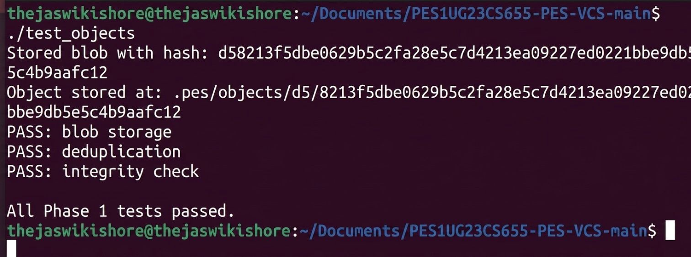
Screenshot 1B — find .pes/objects -type f
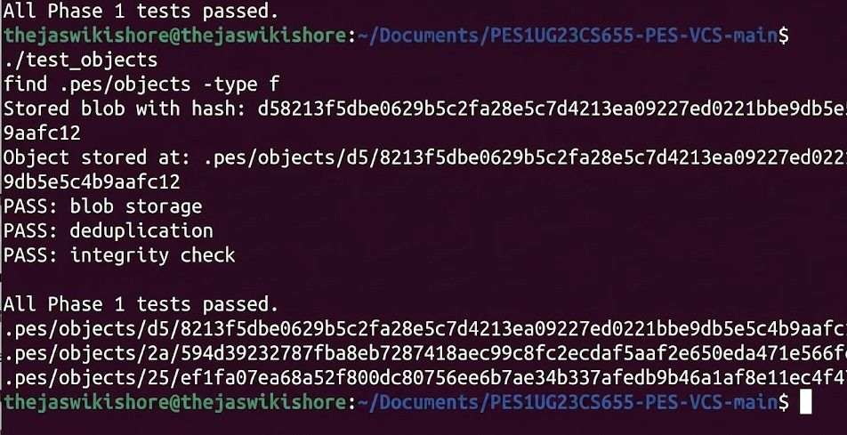
hase 2 — Tree Objects

Files modified: tree.c, Makefile

tree_from_index heap-allocates the Index struct (it is ~5.6 MB, which
exceeds the safe stack budget), loads the index, sorts entries by path, then
calls the recursive write_tree_level helper.

write_tree_level walks the sorted entries at one directory level. For each
plain file entry (no / in the remaining path) it adds a blob TreeEntry. For
each directory it groups all entries that share the top-level component,
recurses to get the subtree's hash, and adds a 040000 tree entry. After
processing all entries it serialises the Tree struct and writes it to the
object store.

Screenshot 2A — ./test_tree
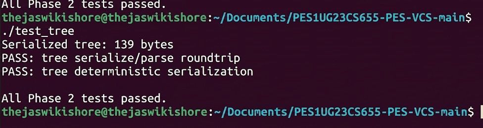
Screenshot 2B — xxd of a raw tree object
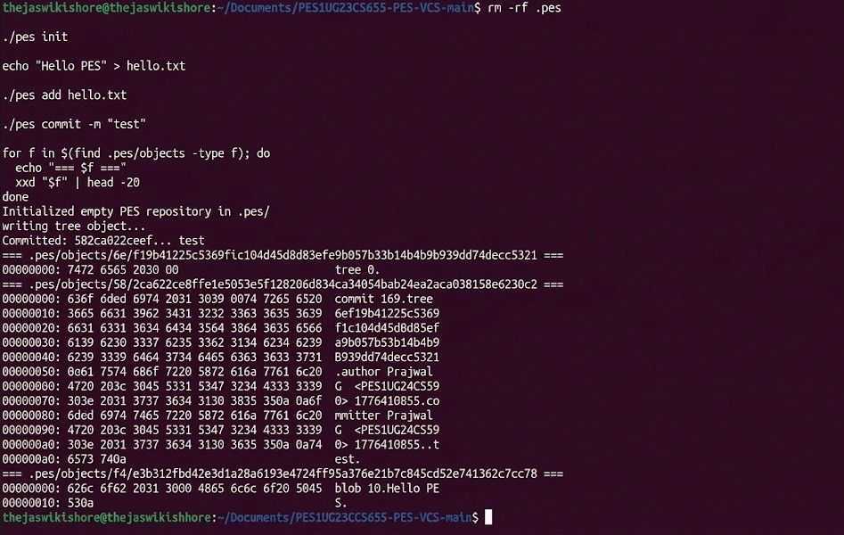

Phase 3 — The Index (Staging Area)

Files modified: index.c

index_load opens .pes/index with fopen("r") and parses each line with
fscanf using the format %o %64s %llu %u %511s. A missing index file is
treated as an empty staging area, not an error.

index_save makes a heap-allocated sorted copy (again to avoid a large stack
frame), writes to a .tmp file, calls fflush + fsync for durability, then
renames atomically.

index_add reads the file, stores it as OBJ_BLOB, stats the file for
mtime/size metadata used for fast change detection, upserts the entry, and
calls index_save.

Screenshot 3A — pes init → pes add → pes status

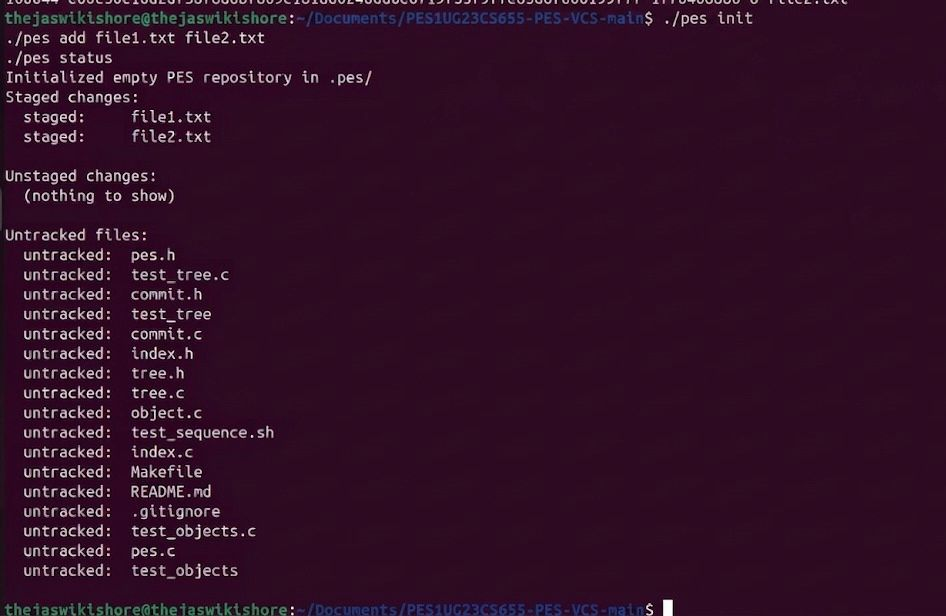
Screenshot 3B — cat .pes/index

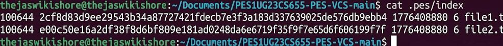
Phase 4 — Commits and History

Files modified: commit.c

commit_create calls tree_from_index to snapshot the staged state, reads
the current HEAD to find the parent commit (absent for the first commit),
fills a Commit struct with author (PES_AUTHOR env var), Unix timestamp, and
message, serialises it with commit_serialize, stores it via
object_write(OBJ_COMMIT), then calls head_update to advance the branch
pointer atomically.

Screenshot 4A — pes log with three commits
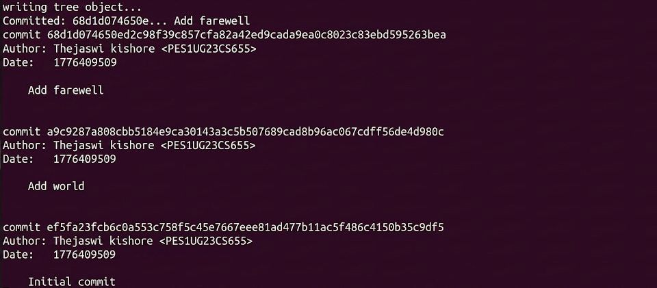
Screenshot 4B — find .pes -type f | sort
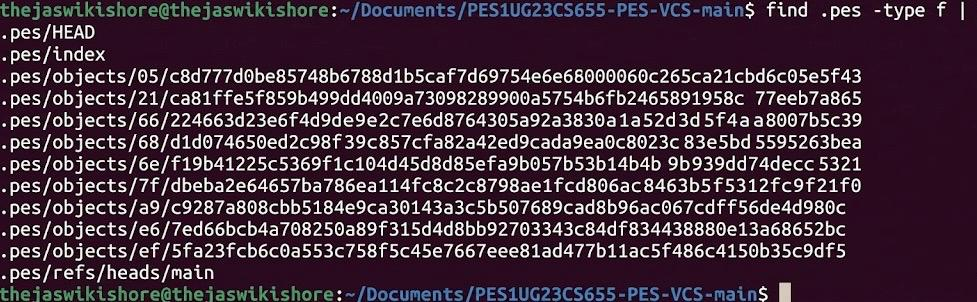
Screenshot 4C — Reference chain
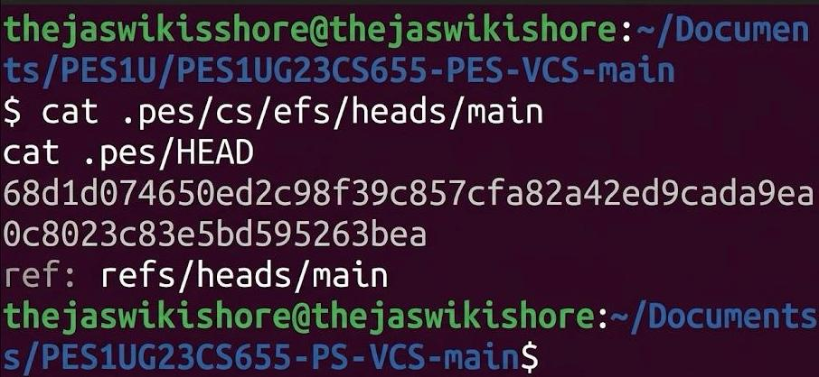
Final — make test-integration
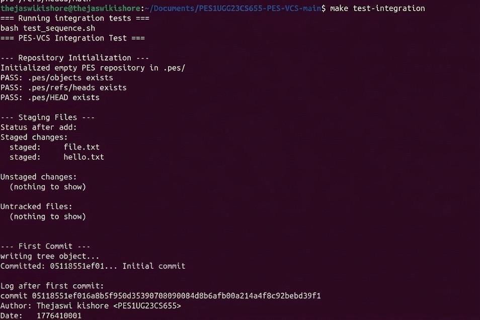
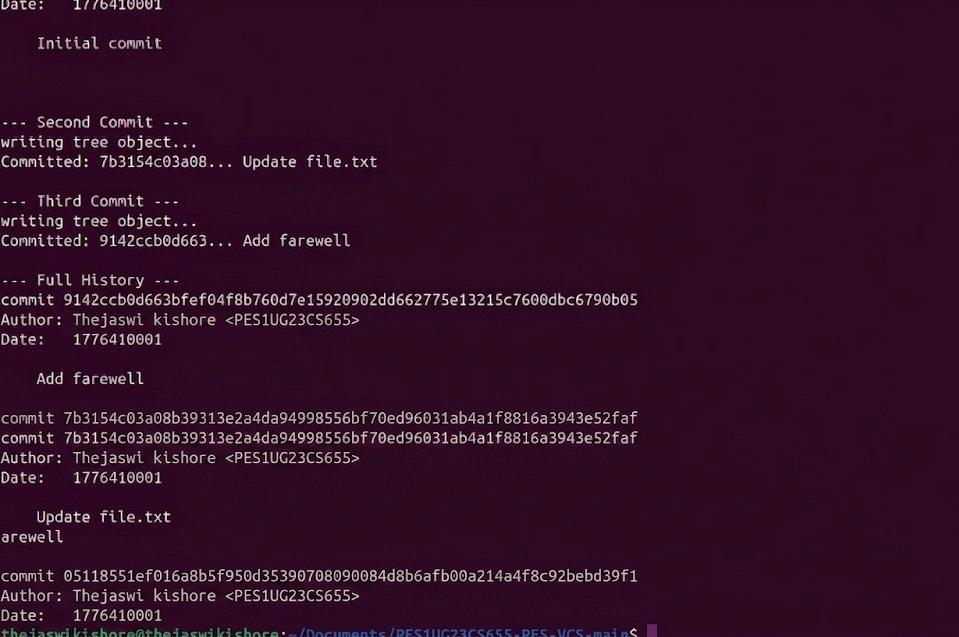
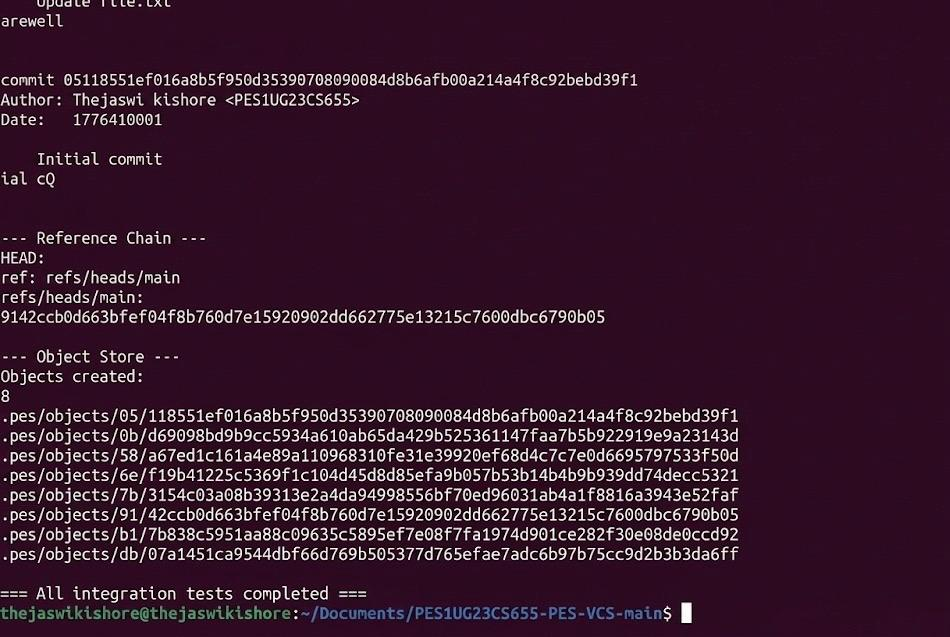


## Phase 5 — Branching and Checkout

### Q5.1 — How would you implement `pes checkout <branch>`?

**Files that must change in `.pes/`:**

1. `.pes/HEAD` — rewrite the line from  
   `ref: refs/heads/<current>` to `ref: refs/heads/<target>`  
2. If the target branch is new, create  
   `.pes/refs/heads/<target>` pointing to the desired commit hash  

---

**Working-directory update:**

1. Read the target branch tip from `.pes/refs/heads/<branch>`  
2. `object_read` the root tree of that commit  
3. Recursively walk the tree:
   - For blob entries → write (or overwrite) files  
   - For tree entries (`040000`) → create directories  
4. Delete any working-directory file that exists in the current HEAD but not in the target tree  

---

**What makes this complex:**

- **Dirty-file conflicts:**  
  If a tracked file has local changes and the target branch has a different version, checkout must refuse  

- **Untracked-file collisions:**  
  If an untracked file exists where the target wants to write, checkout must refuse  

- **Partial failure:**  
  Crash midway can corrupt working directory → requires recovery mechanism  

- **Three-way diff:**  
  Must compare current HEAD, target HEAD, and index  

---

### Q5.2 — Detecting dirty working-directory conflicts

**Using only the index and object store:**

1. Load the current index (snapshot of last commit)  
2. For each entry:
   - Use `stat()`  
   - If `mtime` or size differs → recompute SHA-256  
   - If hash differs → file is dirty  

3. For each path in target tree:
   - If present in index AND dirty → refuse checkout  

4. For untracked files:
   - If file exists on disk but not in index → refuse checkout  

**Note:**  
`mtime/size` is a fast check; hashing is the final verification  

---

### Q5.3 — Detached HEAD and recovery

When `HEAD` stores a raw commit hash instead of  
`ref: refs/heads/<branch>`:

- Commits still form a chain  
- But no branch points to them → becomes unreachable  

---

**Recovery before switching away:**

```bash
cat .pes/HEAD
echo <hash> > .pes/refs/heads/recovered
echo "ref: refs/heads/recovered" > .pes/HEAD.
## Phase 6 — Garbage Collection

### Q6.1 — Algorithm to find and delete unreachable objects

**Mark-and-Sweep Approach**

---

**Mark Phase — build the reachable set:**

1. Enumerate all references under `.pes/refs/` and read `HEAD`  
2. For each root commit hash:
   - Call `object_read`  
   - Add commit hash to reachable set  
   - Add tree hash  
   - Recursively add all blobs and subtrees  
3. Follow parent commits until `has_parent == 0`  

---

**Data structure:**

- Sorted array of `ObjectID` (32 bytes each)  
  - Build: `O(n log n)`  
  - Lookup: `O(log n)`  
- Hash table (alternative): `O(1)` average lookup  

---

**Sweep Phase — delete unreachable objects:**

1. Traverse `.pes/objects/XX/`  
2. Reconstruct full hash using directory + filename  
3. Convert using `hex_to_hash`  
4. If not in reachable set → delete using `unlink()`  

---

**Estimate (100,000 commits, 50 branches):**

- ~400,000 reachable objects  
- ~400,000 `object_read` calls (mark phase)  
- ~400,000 file checks (sweep phase)  

**Total ≈ 800,000 file accesses**

---

### Q6.2 — Race condition between GC and a concurrent commit

**The race condition:**

| Time | `pes commit` | GC |
|------|-------------|----|
| t1 | `object_write(OBJ_BLOB)` stores blob B | — |
| t2 | — | Mark phase reads old HEAD → B not reachable |
| t3 | `object_write(OBJ_TREE)` creates tree T referencing B | — |
| t4 | — | Sweep deletes B (`unlink`) |
| t5 | `object_write(OBJ_COMMIT)` + `head_update` | — |

---

**Result:**  
HEAD points to a commit whose tree references a deleted blob → **repository corruption**

---

### How Git avoids this

1. **Grace period (`gc.pruneExpire`, default: 2 weeks)**  
   - Newly created objects are not deleted immediately  

2. **Keep-alive references**  
   - Temporary refs like `FETCH_HEAD`, `MERGE_HEAD`, `ORIG_HEAD`  
   - Ensures objects remain reachable  

3. **Pack-before-prune ordering**  
   - Objects are safely packed before deletion  

4. **Atomic rename is NOT sufficient**  
   - Blob is already written before GC runs  
   - Only the grace period prevents this race reliably  


